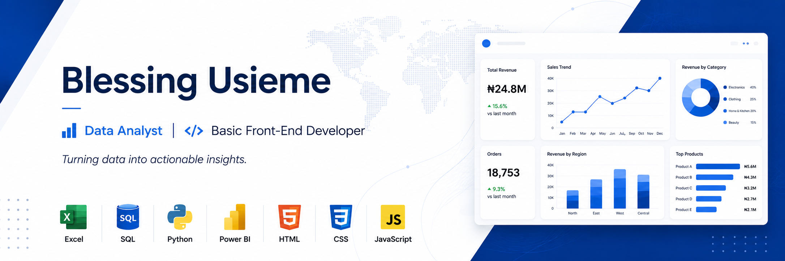

  

## 👋 Hi there, I'm Blessing Usieme

I'm a **Data Analyst** with skills in **Python, MySQL, Microsoft Excel, Power BI**, and **Basic Front-End Development**.

I enjoy transforming raw data into actionable business insights through data cleaning, exploratory analysis, SQL querying, interactive dashboards, and business reporting.

I'm currently building a portfolio of real-world analytics projects across retail, supply chain, education, and HR domains while continuously expanding my knowledge in business intelligence and data analytics.

---

## 📌 Portfolio Highlights

✔ 1 End-to-End Analytics Project Completed

✔ Python • MySQL • Excel • Power BI

✔ Interactive Dashboards

✔ Business Insights & Recommendations

---

## 🛠️ Tools & Technologies

---

## 📈 GitHub Statistics

  
  

---

## 🌟 Featured Repositories

### 📊 Data Analytics

- 📁 **Data Analytics Portfolio**  
  A central hub showcasing all my data analytics projects.
  
- 📊 **[Retail Sales Performance Analysis](https://github.com/yourusername/retail-sales-performance-analysis)**  
  End-to-end retail analytics project using Python, MySQL, Excel, and Power BI.

- 🌾 **Agricultural Supply Chain Analysis** *(Coming Soon)*

- 🎓 **Student Performance Analysis** *(Coming Soon)*

- 👥 **HR Analytics** *(Coming Soon)*

### 💻 Web Development

- 🌐 QR Code Component

- 📸 Client Photography Website

---

## 🌱 Currently Learning

-  Advanced SQL for Analytics
-  DAX & Power BI Optimization
-  Statistical Data Analysis
-  Machine Learning Fundamentals

---
## 📫 Connect with Me

- GitHub: https://github.com/usiemeblessing
- Email: usiemeblessing@gmail.com
- LinkedIn: Coming Soon
- Portfolio Website: Coming Soon
